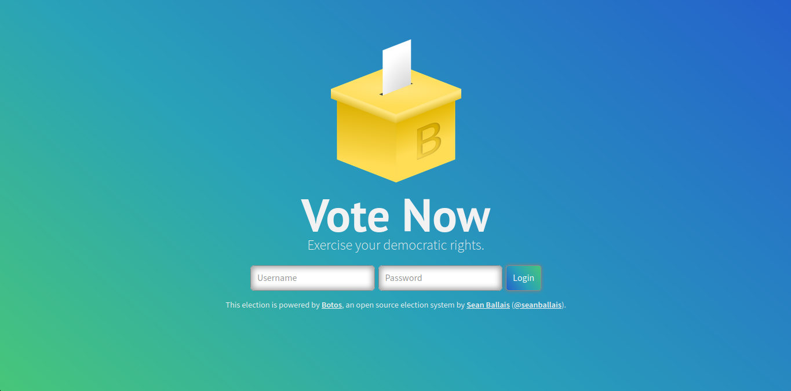

# Botos
> An open source web-based election system for schools.



Botos is a web-based school election system designed for low-coercion risk elections. It is designed to be used in schools for student elections. It supports running multiple different elections in one installation, and real-time viewing and exporting of election results.

## Documentation
Currently, the documentation is a work-in-progress. However, the project itself is already feature-complete. The repository's [wiki](https://github.com/seanballais/botos/wiki) is where you can find this [project's (incomplete) documentation](https://github.com/seanballais/botos/wiki).

### Deployment
Instructions on deploying Botos may be accessed [here](https://github.com/seanballais/botos/wiki/Deployment).

## Bug Reports and Feature Suggestions
If you would like to report a bug or suggest a feature, please consider filing an [issue](https://github.com/seanballais/botos/issues/new). For bug reports, please describe the bug as much as possible, and include a description on how to recreate it.

## Development
Botos is developed using Python 3, and Django. At the moment, the project is using Python 3.12 and Django 5.0. In the future, the project will be moved to a newer version of Python 3 and Django. Aside from the two aforementioned technologies, Botos also uses the following:

 * PostgreSQL 16
 * Django Autocomplete Light
 * OpenPyXL
 * BeautifulSoup 4 (for development)
 * Coverage (for development)

This section is intended for those seeking to contribute or work on Botos. If you are seeking to deploy Botos in a production, please refer to the [Deployment](#deployment) section.

### Setting Up For Development
At the moment, development and deployment is only supported in Linux machines. Development in Windows has incomplete support, but deployment does not. You may attempt to develop **and** deploy Botos in Windows and macOS, but there is no complete documentation available yet. However, macOS users may not need to delve away too much from the set-up process detailed here.

Fork this project repository before continuing. This will allow you to make changes without worrying about write access. Before cloning the forked repository, make sure you have install PostgreSQL 16, Python 3.12, and Pipenv. It is recommended that you install Python using [`pyenv`](https://github.com/pyenv/pyenv), a Python version manager. The database that Botos will use must already be set-up. Please refer to PostgreSQL documentation to know how to set-up a PostgreSQL database.

Once the requirements have been installed, you may now clone the fork.

````
$ git clone <repo_url>/botos
$ cd botos
````

Once you have finishing cloning, perform the following to install the required packages.

````
$ pipenv shell
$ pipenv install
````

Since we're using Pipenv, we have to always run `pipenv shell` before working on Botos. This is because Pipenv provides a virtual environment that isolates dependencies from system-installed dependencies. To learn more virtual environment, you may read [this article](https://realpython.com/python-virtual-environments-a-primer/).

Before we can finally run and start working on Botos, we have to set up environment variables for the database. The following environment variables must exist:

 * `BOTOS_DEBUG` - must be either `True`, `1`, `False`, or `0`. This should be set to `True` in development environments.
 * `BOTOS_DATABASE_HOST` - the PostgreSQL server host (e.g. `localhost`)
 * `BOTOS_DATABASE_PORT` - the port of the PostgreSQL server (e.g. `5432`)
 * `BOTOS_DATABASE_NAME` - the name of the database that Botos will use
 * `BOTOS_DATABASE_USERNAME` - the username of the user to be used for the Botos database
 * `BOTOS_DATABASE_PASSWORD` - the password of the user to be used for the Botos database
 * `BOTOS_TEST_DATABASE_NAME` - the name of the test database for Botos

It is recommended to set the environment variables in an environment file and call your shell to source them. Different shells will require different ways of sourcing variables. For those using shells such as Bash and ZSH, you may refer to [`botos/env/botos.env.sample`](botos/env/botos.env.sample). On the other hand, if you are using PowerShell, you may refer to [`botos/env/botos.env.ps1.sample`](botos/env/botos.env.ps1.sample) instead.

Optionally, you may prefer having the file sourced on start-up of a shell session. This way, you no longer need to export the environment variables every time you start your development machine. If you are using shells like Bash and ZSH, the file can be sourced automatically on start-up by adding the line `source /path/to/environment/file` to one of your shell's session startup files (e.g. `.bash_profile` in Bash, and `.zshenv` in ZSH). If you are using PowerShell, the process is similar. The file can be automatically sourced by adding `. \path\to\environment\file` to your PowerShell profile. Your PowerShell profile's path can be found by running `echo $Profile` in a PowerShell instance. Note that the changes will only take effect when you start a new shell session.

Once you have set-up the environment files, you should create an admin user. Just run:

````
$ python manage.py createsuperuser
````

and fill out the requested information.

At this point, you can now run Botos. You can do so by simply running:

````
$ python manage.py runserver
````

### Running Tests
Make sure that the development dependencies have been installed before running the tests. To run tests, just simply run:

    $ cd /path/to/project/root/
    $ python manage.py test  # or python3, if you're not using virtual environments.

#### Running Tests with Code Coverage
If you would like to have code coverage while running tests, just do the following:

    $ cd /path/to/project/root/
    $ coverage run manage.py test

To view the code coverage report, just do the following:

    $ coverage report

If you want an HTML version of the report, just do the following:

    $ coverage html

The command will produce an HTML version of the report that you can view in the browser with the link, `file://</path/to/project/root>/htmlcov/index.html`, where `</path/to/project/root>` is the absolute path to the root of the project.

### Contributing
If you would like to contribute, please fork this repository first, and make your changes in the fork. Before working on a feature or a fix, please comment in the corresponding issue that you want to work on the feature or provide a fix for a bug. This is so that we can have a better idea on how to implement the feature or fix. If no issue is available, please write [one](https://github.com/seanballais/botos/issues/new), so that we still gather feedback.

Make sure to put all contribution work in your fork, and in a separate branch that is branched off the `develop` branch. The branch name should be prepended with `feature/` if the contribution is a feature, `fix/` if the contribution is a fix for a bug, or `docs/` if the contribution is an improvement to the documentation.

When commiting changes, please use [Gitmoji](https://gitmoji.carloscuesta.me/), and prepend them to the commit message. For example, a commit that adds a button to some web page should have a commit message that is something like:

````
:sparkles: Add awesome button to awesome web page.
````

Don't forget to pull in from the main repository to get the latest changes and to make merging easier. Do not forget to write tests for the feature or fix you are contributing. Contributions without tests will not be merged with the main repository.

Once you have completed your contribution, please a file a [pull request](https://github.com/seanballais/botos/compare) so that we can review your contribution, and merge it when everything checks out.

## Notes

### Vote Encryption
Botos used to have a vote encryption feature. However, it was removed because it wasn't necessary, as the threat model for this system would make this feature overkill and would even add an additional overhead. It was not also used in a production environment. Botos is only expected to be used in elections where there is a low coercion risk, small-scale elections (the size of a high school or elementary school), where the system is run in a local area network, where voting takes place in a voting station, and where skilled malicious attackers are not prevalent nor non-existent. The threat model assumes that the system administration is the highest security risk for the system. The system administrator has the responsibility of ensuring that no data will be leaked nor modified, and the server configuration is robust enough to repel attacks. If the administrator is corrupt, he/she can rig the elections. Even encrypting votes would not provide adequate security as the system administrator still has access to keys to encrypt and decrypt votes. As such, the vote encryption was removed. It is better to focus on introducing or improving other features instead. The feature may be brought back in the server, but only if there is a reasonable demand for it. If you would like to use a more secure election system, I highly recommend checking [Helios](https://github.com/benadida/helios-server).

## Licensing
Botos is licensed under the GNU General Public License v3. See [`LICENSE`](/LICENSE) for details.

Some parts of this project are based on third-party code. See [`THIRD-PARTY-LICENSES.txt`](/THIRD-PARTY-LICENSES.txt) for details.

## Contact
Sean Francis N. Ballais - [@seanballais](https://twitter.com/seanballais) - [sean@seanballais.com](mailto:sean@seanballais.com)
